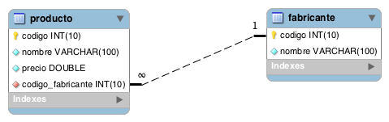

::: titlepage
**Ejercicios SQL**
:::

# Tienda Informática

## Modelo entidad relación



## Crear base de datos

``` sql
  DROP DATABASE IF EXISTS tienda;
   CREATE DATABASE tienda CHARACTER SET utf8mb4;
   USE tienda;
   
   CREATE TABLE fabricante (
     id INT UNSIGNED AUTO_INCREMENT PRIMARY KEY,
     nombre VARCHAR(100) NOT NULL
   );
   
   CREATE TABLE producto (
     id INT UNSIGNED AUTO_INCREMENT PRIMARY KEY,
     nombre VARCHAR(100) NOT NULL,
     precio DOUBLE NOT NULL,
     id_fabricante INT UNSIGNED NOT NULL,
     FOREIGN KEY (id_fabricante) REFERENCES fabricante(id)
   );
   
   INSERT INTO fabricante VALUES(1, 'Asus');
   INSERT INTO fabricante VALUES(2, 'Lenovo');
   INSERT INTO fabricante VALUES(3, 'Hewlett-Packard');
   INSERT INTO fabricante VALUES(4, 'Samsung');
   INSERT INTO fabricante VALUES(5, 'Seagate');
   INSERT INTO fabricante VALUES(6, 'Crucial');
   INSERT INTO fabricante VALUES(7, 'Gigabyte');
   INSERT INTO fabricante VALUES(8, 'Huawei');
   INSERT INTO fabricante VALUES(9, 'Xiaomi');
   
   INSERT INTO producto VALUES(1, 'Disco duro SATA3 1TB', 86.99, 5);
   INSERT INTO producto VALUES(2, 'Memoria RAM DDR4 8GB', 120, 6);
   INSERT INTO producto VALUES(3, 'Disco SSD 1 TB', 150.99, 4);
   INSERT INTO producto VALUES(4, 'GeForce GTX 1050Ti', 185, 7);
   INSERT INTO producto VALUES(5, 'GeForce GTX 1080 Xtreme', 755, 6);
   INSERT INTO producto VALUES(6, 'Monitor 24 LED Full HD', 202, 1);
   INSERT INTO producto VALUES(7, 'Monitor 27 LED Full HD', 245.99, 1);
  
   INSERT INTO producto VALUES(10, 'Impresora HP Deskjet 3720', 59.99, 3);
   INSERT INTO producto VALUES(11, 'Impresora HP Laserjet Pro M26nw', 180, 3);
```

## Consultas sobre una tabla

### Lista el nombre de todos los productos que hay en la tabla ***producto***

```sql
SELECT nombre FROM producto;
```

### Lista los ***nombres*** y los ***precios*** de todos los ***productos*** de la tabla ***producto*** 

\|SELECT nombre, precio FROM producto;\|

### Lista todas las columnas de la tabla ***producto***

\|SELECT \* FROM producto;\|

### Lista el ***nombre*** de los productos y el ***precio en euros*** y el ***precio en dólares estadounidenses***

\|SELECT nombre, precio / 21, precio / 18 FROM producto;\|

### Lista el ***nombre*** de los productos, el ***precio en euros*** y el ***precio en dólares***. Utiliza los siguientes alias para las columnas: ***nombre de producto, euros, dólares***

\|SELECT nombre as \"nombre de producto\", precio / 18 as euro, precio /
21 as dólares FROM producto;\|

### Lista los ***nombres*** y los ***precios*** de todos los productos de la tabla ***producto***, convirtiendo los ***nombres*** a ***mayúsculas***

\|SELECT upper(nombre) as \"NOMBRE PRODUCTO\", precio as PRECIO FROM
producto;\|
